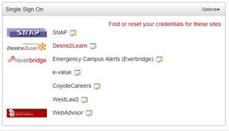

# Gateway SSO Configuration
*THIS PORTLET TYPE IS DEPRECATED*



 
## Workflow
The workflow for accessing an external system through Gateway SSO is as follows (assuming that the portlet is configured
and will be rendered on the user's page):

Rendering the portlet:
1. The main portlet controller loops through each GatewayEntry associated with the portlet.
2. Each GatewayEntry runs through each Interceptor associated with it to ensure that the entry is valid
3. The main JSP render the gateway portlet (list of external systems to connect to).  Each GatewayEntry is rendered on
   the page, displaying the name, icon and if valid a link to the external system.  Invalid external systems display a
   message describing the issue (such as credentials not being configured).

Processing the gateway link:
1. The user clicks on the link for the external system they wish to access.  By default this opens a new tab that
   returns a page with a Javascript AJAX handler to request connection information from the handling controller,
   but there is a portlet preference to replace the existing page. 
2. The handling controller gathers all of the information stored in the HttpContentRequestImpl parameters configuration
   (basically a list of form fields and values) and readies them for return to the browser.
3. All configured Interceptors perform any substitutions on configuration data, such as inserting usernames and passwords.
4. All configured IAuthenticationFormModifier modules run.  These can add additional parameter fields to the result and
   may perform additional custom logic (depending upon the implementation).  An example of an IAuthenticationFormModifier
   is a need to contact an external system to get a token that is submitted with the authentication form to the external
   system.  The custom logic can invoke the external system, parse out the token, and add it as a form field or modify
   the submit URL to include the token.
5. If the GatewayEntry is flagged as requiring a secure URL (default true), the URL (proxiedLocation) is checked and
   altered to /HTTPSUrlRequiredButNotSpecified if it was not secure.
6. The controller returns all of the gathered data to the browser (by default a JSON response with caching disabled).
7. The Javascript Ajax handler builds an appropriate html form and submits it to the external system.  As part of this
   processing, any custom javascript files that are specified for the entry are also executed.  The external system then
   handles the call and will render whatever page a successful login would render.
 
## Portlet Configuration
Gateway SSO must be defined in portlet.xml, like any other portlet. 

  ```
    <portlet>
        <portlet-name>GatewayPortlet</portlet-name>
        <portlet-class>org.springframework.web.portlet.DispatcherPortlet</portlet-class>
        <init-param>
            <name>contextConfigLocation</name>
            <value>/WEB-INF/context/portlet/gateway-sso-portlet.xml</value>
        </init-param>
        <expiration-cache>0</expiration-cache>
        <supports>
            <mime-type>text/html</mime-type>
            <portlet-mode>view</portlet-mode>
            <portlet-mode>edit</portlet-mode>
        </supports>
        <portlet-info>
            <title>WebProxy Portlet</title>
        </portlet-info>
        <portlet-preferences>
            <preference>
                <name>openInNewPage</name>
                <value>true</value>
            </preference>
        </portlet-preferences>
    </portlet>
  ```

One interesting portlet preference is "openInNewPage".  True will direct the response after clicking on the link to a
new tab in your browser; false will direct to the current tab.

The description of the portlet itself lives in the portlet definition file:

  ```
<beans xmlns="http://www.springframework.org/schema/beans" xmlns:xsi="http://www.w3.org/2001/XMLSchema-instance"
       xmlns:context="http://www.springframework.org/schema/context" xmlns:p="http://www.springframework.org/schema/p"
       xmlns:util="http://www.springframework.org/schema/util"
       xsi:schemaLocation="http://www.springframework.org/schema/beans http://www.springframework.org/schema/beans/spring-beans.xsd
      http://www.springframework.org/schema/context http://www.springframework.org/schema/context/spring-context.xsd
      http://www.springframework.org/schema/util http://www.springframework.org/schema/util/spring-util.xsd">

    <context:component-scan base-package="org.jasig.portlet.proxy.mvc.portlet.gateway" />
    <context:annotation-config />

    <bean
            class="org.springframework.beans.factory.config.PropertyPlaceholderConfigurer">
        <property name="location" value="classpath:configuration.properties" />
    </bean>
    <util:list id="gatewayEntries">
        <!--
            Gateway SSO allows the user to sign onto remote systems through capture of credentials and
            replay of those credentials on remote systems.  Each bean in the contentRequest list is for a
            different system.  The parameters property lists the fields that will be added to a form and then
            submitted to the proxiedLocation in order to authenticate.  The formFieldImpl class contains three
            fields: the field name, value, and whether the field is secured.  Secured is only relevant at this
            point for the portlet preferences interceptor, since those preferences must be stored in the database
            and are presented to the user in an HTML password input field instead of an HTML text input field.

            The following bean shows two interceptors. Refer to those two classes for the format of values that
            will be substituted.

            userInfoUrlParameterizingPreInterceptor - will replace parameters with information from the portal's userInfo.

            userPreferencesPreInterceptor - will replace parameters with information stored in portal preferences
            for the current user.

            This bean also demonstrates an optional whitelist of roles defined in portlet.xml.  If any roles are
            specified and the user is not in any of them, the gateway entry does not appear on the UI.

            This bean also demonstrates a custom java class ExampleCustomFormModifier that modifies the form by invoking another system to obtain
            a token that must be embedded in the POST URL with a special name.  It also adds the calculated field
            as a form field so custom javascript (custom-javascript.js) can be executed before the form is posted to perform additional
            custom operations, in this case to also set the window name to the calculated field.
        -->
        <bean class="org.jasig.portlet.proxy.mvc.portlet.gateway.GatewayEntry" p:name="MyZimbra"
              p:iconUrl="/ResourceServingWebapp/rs/tango/0.8.90/32x32/apps/internet-mail.png"
              p:javascriptFile="/WebProxyPortlet/scripts/custom-javascript.js">

            <!-- Custom java form fields.  Beans in list must implement org.jasig.portlet.proxy.mvc.service.web.IAuthenticationFormModifier
                interface. They can add form fields based on custom logic, or modifying the url to submit to. -->
            <property name="authenticationFormModifier">
                <util:list>
                    <bean class="org.jasig.portlet.proxy.service.web.ExampleCustomFormModifier"/>
                </util:list>
            </property>

            <property name="contentRequests">
                <util:map>
                    <entry>
                        <key>
                            <bean class="org.jasig.portlet.proxy.service.web.HttpContentRequestImpl"
                                  p:proxiedLocation="https://zimbra.unicon.net/zimbra/"
                                  p:form="true" p:method="POST">
                                <property name="parameters">
                                    <util:map>
                                        <entry>
                                            <key><value>username</value></key>
                                            <bean class="org.jasig.portlet.proxy.service.web.FormFieldImpl"
                                                  p:name="username" p:value="{prefs.myzimbra.uid}"/>
                                        </entry>
                                        <entry>
                                            <key><value>password</value></key>
                                            <bean class="org.jasig.portlet.proxy.service.web.FormFieldImpl"
                                                  p:name="password" p:value="{prefs.myzimbra.pwd}" p:secured="true"/>
                                        </entry>
                                        <entry>
                                            <key><value>loginOp</value></key>
                                            <bean class="org.jasig.portlet.proxy.service.web.FormFieldImpl"
                                                  p:name="loginOp" p:value="login"/>
                                        </entry>
                                        <entry>
                                            <key><value>client</value></key>
                                            <bean class="org.jasig.portlet.proxy.service.web.FormFieldImpl"
                                                  p:name="client" p:value="preferred"/>
                                        </entry>
                                    </util:map>
                                </property>
                            </bean>
                        </key>
                        <util:list>
                            <ref bean="userInfoUrlParameterizingPreInterceptor" />
                            <ref bean="UserPreferencesPreInterceptor" />
                        </util:list>
                    </entry>
                </util:map>
            </property>
            <!-- Whitelist of roles (from PAGS, SmartLDAP, internal roles, etc.) that this entry shows up for.  If no roleWhitelistProperty, then everyone has access to the entry. -->
            <property name="roleWhitelist">
                <list>
                    <value>Staff</value>
                </list>
            </property>
        </bean>


        <!-- additional external systems to display -->
        <bean ...></bean> 
    </util:list>
    <bean class="org.springframework.web.portlet.mvc.annotation.DefaultAnnotationHandlerMapping">
        <property name="interceptors"><bean class="org.jasig.portlet.proxy.mvc.MinimizedStateHandlerInterceptor"/></property>
    </bean>

</beans>
  ```
  
## GatewayEntry
Each external systems to which you want to connect has its own GatewayEntry record.  This record contains the name and
location of the Icon to represent the application.   It also contains a list of HttpContentRequestImpl records and any
external logic to be executed.

## HttpContentRequestImpl
In theory each GatewayEntry could have multiple HttpContentRequestImpl records associated with it; in practice, each
GatewayEntry would only have one HttpContentRequestImpl record (see ) .  This record contains the web address that will
receive the form submission, the HTTP method type (GET, POST, PUT, DELETE), and a list of form fields to be included in
the form submission.

## FormFieldImpl
FormFieldImpl contains the information about each field that will be included in the form submitted to the external
system.  The relevant fields are:
  - name - the name of the HTML field.  proxiedLocation is a special value that alters the location the form POSTs to
  - value - the value of the HTML field.  This field is either a static value or a value that an Interceptor will
    recognize as being overridden.
  - secured - whether the field should be sent as input type of "text" or "password".  If secured is true, it sends as
    a password field.  In addition, if the secured field is an overridden field that is editable, the editable field
    will be obscured when editable and will be encrypted when stored.
    
## Interceptors
Interceptors examine FormFieldImpl objects before they are returned to the JSP and perform a substitution if the field
should be substituted.  The interceptor itself is responsible for knowing whether the value should be overridden. 
For example,

  ```
                            <bean class="org.jasig.portlet.proxy.service.web.HttpContentRequestImpl"
                                  p:proxiedLocation="https://zimbra.unicon.net/zimbra/"
                                  p:form="true" p:method="POST">
                                <property name="parameters">
                                    <util:map>
                                        <entry>
                                            <key><value>loginOp</value></key>
                                            <bean class="org.jasig.portlet.proxy.service.web.FormFieldImpl"
                                                    p:name="loginOp" p:value="login"/>
                                        </entry>
                                        <entry>
                                            <key><value>username</value></key>
                                            <bean class="org.jasig.portlet.proxy.service.web.FormFieldImpl"
                                                    p:name="username" p:value="{prefs.myzimbra.uid}"/>
                                        </entry>
                                        ...
                                     </util:map>
                                </property>
                            </bean>
  ```

The FormFieldImpl entry for loginOp shows a value of "login".  No current interceptors would match this.

The FormFieldImpl entry for username shows a valud of "{prefs.myzimbra.uid}", which the UserPreferencePreInterceptor
would recognize as a PortletPreference and would substitute the value found for this field if
UserPreferencePreInterceptor is configured for this HttpContentRequestImpl.

## IPreInterceptor
IPreInterceptor is an interface that all Interceptors must implement.  Interceptors substitute values into FormFieldImpl
objects.  Multiple interceptors can be associated with HttpContextRequestImpl objects.  It has two methods:
  - intercept() - substitutes the configured value for another, if necessary
  - validate() - returns true if all of the information needed to perform a substitution is available, otherwise false

## UserPreferencePreInterceptor
UserPreferencePreInterceptor overrides FormFieldImpl values with values that are stored in PortletPreferences.  When
this interceptor runs, it looks for FormFieldImpl values that match the regex.  By default, your portlet will use the
regex of "\\{prefs\\.[\\w.]+\\}", but this can be changed in configuration.properties of the portlet.  An example of a
valid FormFieldImpl value would be "{prefs.myzimbra.uid}".

These portlet preferences can be edited by the user.  The portlet must be configured to support Edit mode.
All FormFieldImpl values that match the preferences regex will be displayed for the user to edit as preferences and will
be persisted.  Secured fields will be encrypted in the database and will be obscured on the Portlet's Edit page.
To use this interceptor, the encryption password must be set for the bean "stringEncryptionService" in
applicationContext.xml.
 
## UserInfoUrlParameterizingPreInterceptor
UserInfoUrlParameterizingPreInterceptor overrides FormFieldImpl values with the values stored in UserInfo.
uPortal can be configured to store your uPortal login and password, making them available to userInfo.
If uPortal is configured this way (refer to the uPortal manual for exposing user attributes to a portlet), this
interceptor will send the same uid and password that you used to authenticate to uPortal to the external system.
Since uPortal and the external system do not share an authentication system, it is still possible for the two systems
to get out of sync.  An example of a valid FormFieldImpl value would be "{user.login.id}".

# Custom Java logic
Java Beans that implement IAuthenticationFormModifier can be embedded in your Gateway SSO to support more complicated
scenarios.  The user can create their own Java Bean that implements the IAuthenticationFormModifier interface and
include it in the portlet definition.  The IAuthenticationFormModifier classes can add or remove fields from the form
or change the url the form posts to.

For example, say you have an external system to which you wish to login.  Before you actually login, however, you need
to retrieve a token from another system and include it in the submitted form or on the form's action field.  You can
write a custom logic bean that will retrieve that value and include it as a field in the submission.

This is how you might add IAuthenticationFormModifier to your portlet definition file

  ```
          <bean class="org.jasig.portlet.proxy.mvc.portlet.gateway.GatewayEntry" p:name="MyZimbra"
              p:iconUrl="/ResourceServingWebapp/rs/tango/0.8.90/32x32/apps/internet-mail.png">

            <property name="authenticationFormModifier">
                <util:list>
                    <bean class="org.jasig.portlet.proxy.service.web.ExampleCustomFormModifier"/>
                </util:list>
            </property>

            ...
        </bean> 
  ```

## IAuthenticationFormModifier
IAuthenticationFormModifier is an interface that must be implemented by any classes that wish to hook into the
IAuthenticationFormModifier process.  It has the method:
  - void modifyHttpContentRequest(HttpContentRequestImpl contentRequest, PortletPreferences preferences)
Your implementation can be as simple or as complicated as needed and can add form fields, change the Url to submit to,
etc.  PortletPreferences are available to your bean.

# Custom JavaScript code
The gateway page can be configured to obtain and execute a custom javascript file to perform whatever behaviors are
necessary for the single sign-on.  For example, the window name can be changed to match some particular value.
The javascript has full access to the form that will be submitted and can perform whatever custom logic is desired.
The javascript is loaded and executed using an eval() javascript statement, so troubleshooting is a bit more difficult
as you cannot set breakpoints in the javascript. To add custom javascript to the execution, specify its location in the
GatewayEntry bean; e.g.

  ```
<bean class="org.jasig.portlet.proxy.mvc.portlet.gateway.GatewayEntry" p:name="WebAdvisor"
      p:iconUrl="/ResourceServingWebapp/rs/tango/0.8.90/32x32/apps/internet-web-browser.png"
      p:javascriptFile="/WebProxyPortlet/scripts/custom-javascript.js">
...
</bean>
  ```

# Security Considerations
  - uPortal should use HTTPS for its connections to the browser to insure user passwords are not intercepted in transit
    to the user's browser
  - If using UserPreferencePreInterceptor, the encryption key must be changed from the default (an error message is
    displayed in the log files if the key is the default value)
  - The target URLs to submit to (proxiedLocation) should be HTTPS (required by default)
  - The HTTP response including sensitive user information is set to request not caching the response.  However the
    user's passwords are not encrypted in transit other than the encryption used by HTTPS.  If greater security is
    required, you can encrypt the password for the gateway form response and add a javascript library to decrypt it,
    though this does not add much security since sophisticated users can figure this out.
