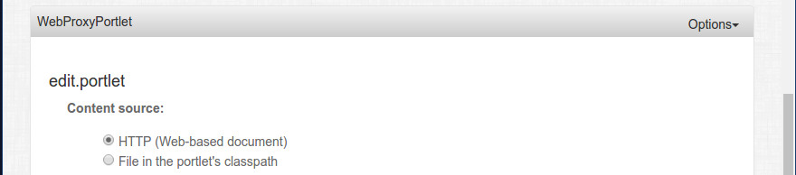
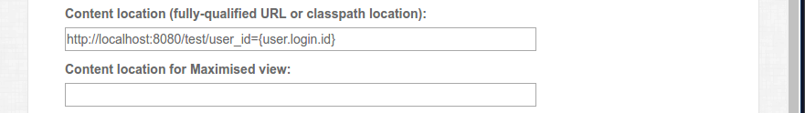
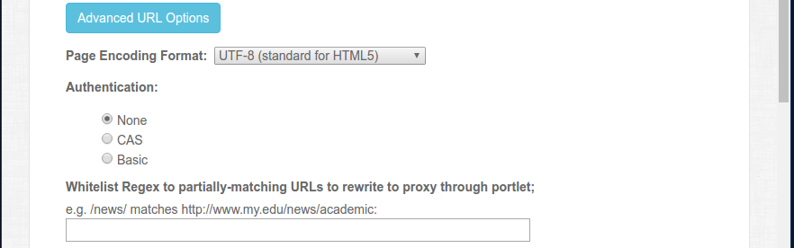
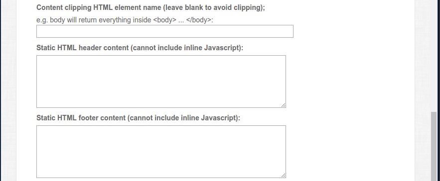
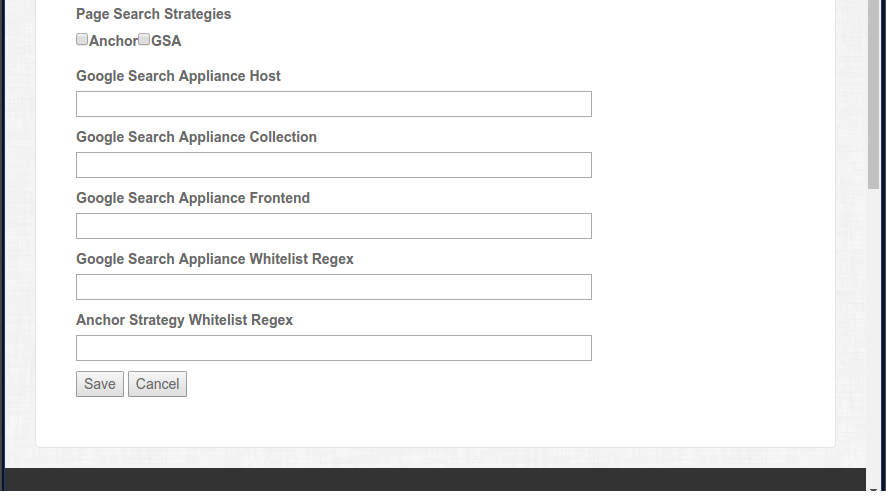

# Web Proxy Portlet Configuration

There are several preferences for Web Proxy Portlet. Most are best set
on the dedicated configuration page rather than via portlet preferences UI.

## Configuration Page Preferences



### Content source (contentService)
Content source simply determines whether the content will be retrieved from the
classpath or from the web. This will dictate the appropriate class to use for
retrieving the content.



### Content location (location)
This is the fully-qualified URL or classpath location for the content to proxy. This value will be parsed by interceptors,
such as the one that substitutes user attributes for tokens.

### location.MAXIMIZED
This is an optional value used when the portlet is maximized. If no value is entered, then this defaults back to the
location value.



### Page Encoding Format (sourcePageCharacterEncoding)
Encoding expecting for the proxied content.

### Authentication (authType)
Authentication type.

### Whitelist Regex (whitelistRegexes)
Rewrite URLs in the proxied content that match the regex. This includes other references besides anchors, such as
images.



### Content clipping HTML element name (clippingSelector)
HTML element content to be displayed. This is often "body" for the content of the <body> content.

### Static HTML header content (headerHtml)
Static content to be prepended to the proxied content before displaying to user.

### Static HTML header content (footerHtml)
Static content to be appended to the proxied content before displaying to user.



### Page Search Strategies (searchStrategies)

### gsaHost

### gsaCollection

### gsaFrontend

### gsaWhitelistRegex

### anchorWhitelistRegex

## Preferences not included on the Configuration Page
The following preferences are set in the portlet admin UI and are not accessible on the configuration page. These usually
apply across all web proxy portlets for an installation.

### httpClientConnectionTimeout (default to 10000ms)
Timeout limit in milliseconds for making a connection to the web content.

### httpClientSocketTimeout (default to 10000ms)
Timeout limit in milliseconds for socket packet replies from the web content.

### preInterceptors
The pre-interceptors consist of authentication interceptors and URL paramatizing
interceptors. The authenticator interceptors implement the `authType`. The URL
paramatizing interceptors are used on the location values.

#### PortletPreferencesBasicAuthenticationPreInterceptor
Authentication interceptor used to authentication to a proxied resource with global credentials used by all users.
The credentials are defined by the following portlet preferences:
  - PortletPreferencesBasicAuthenticationPreInterceptor.username
  - PortletPreferencesBasicAuthenticationPreInterceptor.password

#### ProxyCASAuthenticationPreInterceptor
Authentication interceptor using Proxy CAS. The user attribute `casProxyTicket` must be set and the uPortal
needs to be configured for CAS Proxy.

See <https://wiki.jasig.org/display/UPM43/Portlets+using+Proxy+CAS>

#### UserInfoBasicAuthenticationPreInterceptor
This interceptor sends user attribute values as credentials for basic authentication with the proxied source.
The attributes used default to `user.login.id` for the username and `password` for the password.

Attributes used for authentication can be overridden by setting the attribute name as the value for the following preferences:
  - "usernameKey"
  - "passwordKey"

Any any case, keys should exist in PortletRequest.USER_INFO attribute of the request.
This means defining them as user attributes in the porlet definition file.

#### UserInfoUrlParameterizingPreInterceptor
This interceptor can dynamically insert values from the UserInfo map into the URL, query string, and form parameters.
Any value of the format {keyName} will be replaced the value of that key in the UserInfo map, assuming one exists.
If no value for the key exists, the string will not be replaced. The Rich Configuration admin page automatically adds
this filter.

Note: the keys need to be defined as user attributes in the portlet definition file.

#### UserPreferencesPreInterceptor

#### HeaderPassingPreInterceptor
This interceptor will pass along user attribute headers to the proxy request.  
Configured by adding the user attributes desired in the portlet.xml file.  
Included casProxyTicket is an example.  Then in the portlet publishing XML file,
 you add the preInterceptor as described above.  Example:

```xml
<portlet-preference>
  <name>preInterceptors</name>
  <value>headerPassingPreInterceptor</value>
</portlet-preference>
```

Then you add a portlet preference listing the headers you want to pass.  The
name to use is HeaderPassingPreInterceptor.HEADER_PREFERENCE (`headers`)
Example:

```xml
<portlet-preference>
  <name>headers</name>
  <value>uid</value>
  <value>displayName</value>
  <value>cn</value>
  <value>givenName</value>
  <value>mail</value>
  <value>telephoneNumber</value>
</portlet-preference>
```

Those are the names of the headers you will be sending. The user attributes you
will send are  in the portlet preference named
HeaderPassingPreInterceptor.HEADER_PREFERENCE_VALUES ('headerValues'). It is an
ordered list that you need to keep in sync with headerNames.  This allows you to
rename your header names in case they aren't exactly in sync with the user
attributes.

```xml
<portlet-preference>
  <name>headerValues</name>
  <value>userName</value>
  <value>wiscedupvi</value>
  <value>displayName</value>
  <value>wisceduudds</value>
  <value>cn</value>
  <value>givenNameOfUser</value>
</portlet-preference>
```

Usage is if the proxied content uses header attributes to display certain
information to the user for a more customized experience

### filters
Filters should automatically be added based on non-empty values for their respective
preferences (except URLRewritingFilter).

#### ContentClippingFilter
This filter is added and performs the work when a value is entered for `clippingSelector`.

#### HeaderFooterFilter
This filter is added and performs the work when static head and/or footer HTML is
entered for `headerHtml` or `footerHtml`.

#### URLRewritingFilter
The URL rewriting filter is a key component for any document retrieved via the HTTP content service.
This filters rewrites any relative URLs to include the target server and can additionally proxy additional resources
from the portlet.  For example, the portlet may be configured to proxy images, scripts, or target URLs.

Proxying behavior is controlled by the "whitelistRegexes" portlet preference.
This preference should represent zero or more regexes describing which URL paths the portlet should proxy
beyond the initial HTTP page request.  The regex expression only has to match part of the url; e.g.
if the url is http://www.net.edu/news/hello.news and the regex is "/news/" it will match.
See <http://docs.oracle.com/javase/7/docs/api/java/util/regex/Matcher.html#find()>.
The Rich Configuration admin page allows entry of a single Whitelist regex expression and dynamically adds
this filter based on its presence.

To provide multiple regex patterns you must edit the portlet publishing XML file, or just provide
a more complex regex pattern.
